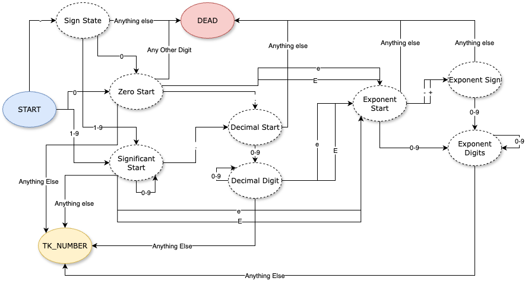

# Solution to Parse JSON

For this project, we have to understand how the compiler front end works - specifically the lexer and parser.

The lexer has the responsibility to tokenize the input stream and work on syntax errors like the program. We have to do
ensure that a proper state machine with grammar rules is working.

The parser works on top of lexer for which we have to do Bottom Up Parsing.

# Tokens

Here are the tokens that are directly one word aka simple tokens:

```text
TK_OPEN_BRACE ::= {
TK_CLOSE_BRACE ::= }
TK_OPEN_BRACKET ::= [
TK_CLOSE_BRACKET ::= ]
TK_COLON ::= :
TK_COMMA ::= ,
TK_TRUE ::= true
TK_FALSE ::= false
TK_NULL ::= null
```

The above tokens have the following FSM:


The remaining tokens are the complex tokens that are not one word rather than they require a proper FSM context to be 
used to work - TK_NUMBER and TK_STRING.

```
TK_NUMBER ::= FTK_SIGN FTK_NUMERICAL | FTK_NUMERICAL
FTK_SIGN ::= -
FTK_NUMERICAL ::= FTK_START_PATTERN FTK_DECIMAL_EXPONENT | FTK_START_PATTERN
FTK_START_PATTERN ::= 0 | [1-9](0-9)*
FTK_DECIMAL_EXPONENT ::= FTK_DECIMAL | FTK_EXPONENT | FTK_DECIMAL FTK_EXPONENT
FTK_DECIMAL ::= .[0-9]+
FTK_EXPONENT ::= [eE][+-]?[0-9]+
```

The FSM for TK_NUMBER is as follows:



Here FTK are essentially Fake Token created to tell how the lexer would interpret the number. Similarly for TK_STRING:

```
TK_STRING ::= FTK_DOUBLE_QUOTE FTK_STRING_CONTENT
FTK_DOUBLE_QUOTE ::= "
FTK_STRING_CONTENT ::= [All Code point except \ or " or Control Character] FTK_STRING_CONTENT | \ FTK_SLASH_CONTENT FTK_STRING_CONTENT | FTK_DOUBLE_QUOTE
FTK_SLASH_CONTENT ::= " | \ | / | b | f | n | r | t | u([0-9A-Fa-f]{4})
```

The goal of LEXER is to tokenize the input stream and work in deterministic manner to just determine correct characters.


---

As seen that there are multiple unique states that are associated with each token creation - we would have to write code
with an abstract class that would do the important actions like recording line number, character count and passing error
back to error boundary in case of any error.

While explict states will do only one thing - when receiving next byte and input stream, they will transition to next 
state and if required unget the byte. Thus we will use State Pattern to implement this and have a collection of states
in each HashMap allowing for enums to be used to get the required state.

Instead of using context we will directly communicate with State Enums and using the integer value if they belong to say
a certain range we will say that we have now successfully parsed the token and we can move on to next token.

# Grammar

The following grammar is what I have decided to implement to work on with ease:

```
<program> ::= <value_singleton>
<object> ::= TK_OPEN_BRACE <statement> TK_CLOSE_BRACE | TK_OPEN_BRACE TK_CLOSE_BRACE
<array> ::= TK_OPEN_BRACKET <value> TK_CLOSE_BRACKET | TK_OPEN_BRACKET TK_CLOSE_BRACKET

<statement> ::= TK_STRING TK_COLON <value> | TK_STRING TK_COLON <value> TK_COMMA <statement>
<value> ::= <value_singleton> | <value_singleton> TK_COMMA <value>
<value_singleton> ::= TK_STRING | TK_NUMBER | TK_TRUE | TK_FALSE | TK_NULL | <object> | <array>

```
